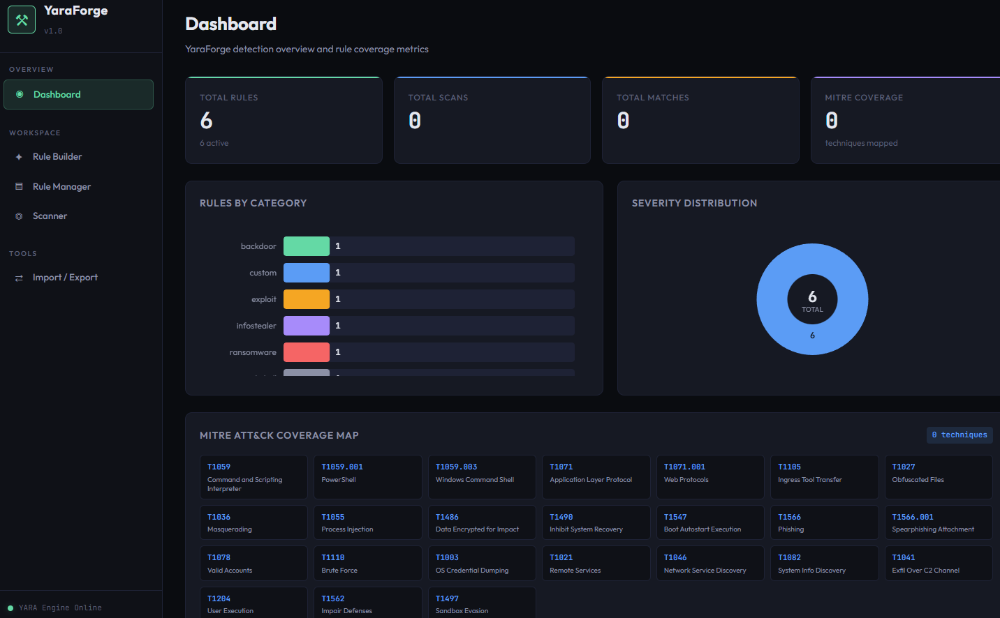
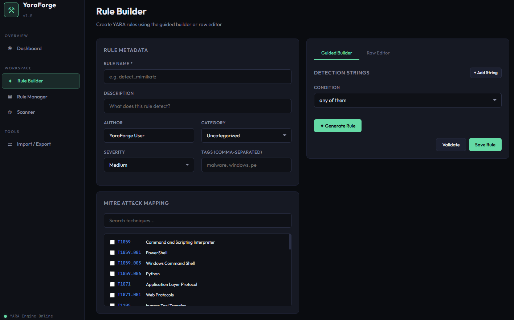
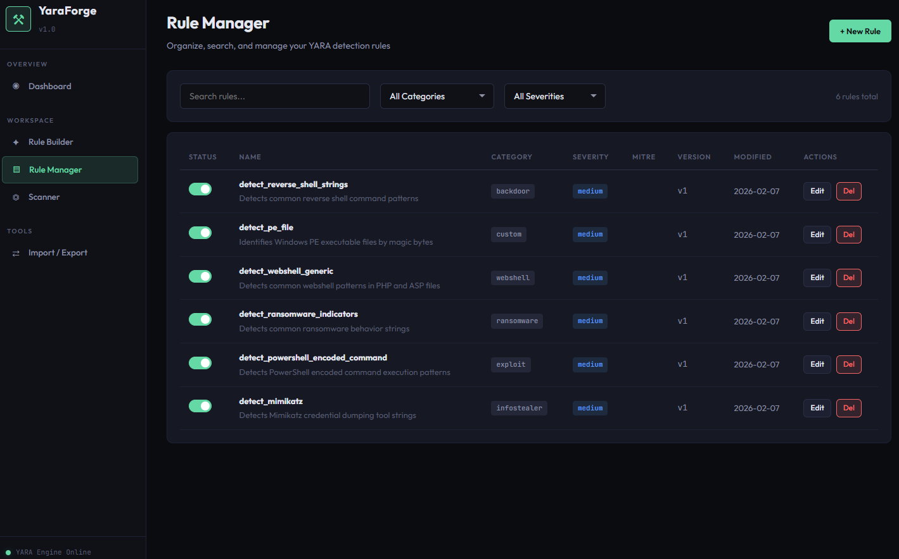
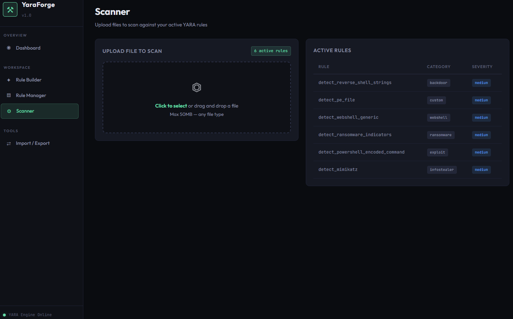
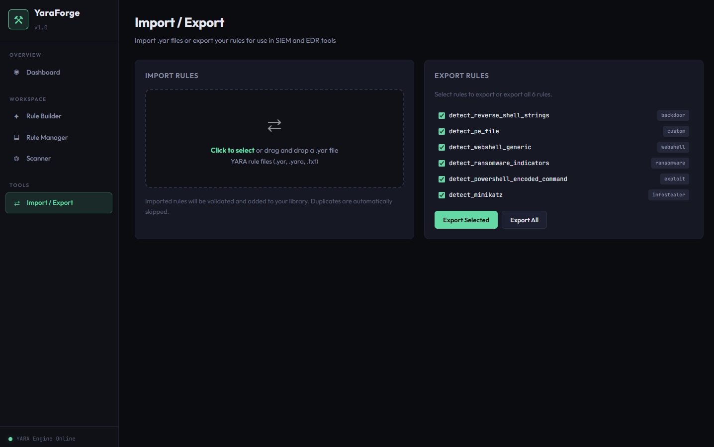

<div align="center">

# 🔬 YaraForge


**YARA Rule Generator & Testing Platform**


A Flask-based platform for building, managing, testing, and visualizing YARA rules — with MITRE ATT&CK mapping and a detection dashboard. Built with Python/Flask.


  


</div>

---

## Dashboard



Real-time detection overview with rule statistics, MITRE ATT&CK coverage heat map, severity distribution, and recent scan history.

---

## Features

### Rule Builder



- **Guided mode** — form-based string/condition builder that generates valid YARA syntax automatically
- **Raw editor** — full YARA syntax editor with real-time validation
- **MITRE ATT&CK mapping** — tag rules with technique IDs for coverage tracking
- **Metadata management** — severity levels, categories, tags, and author attribution

### Rule Manager



- Search, filter, and organize rules by category and severity
- Toggle rules active/inactive for selective scanning
- Version history tracking for rule changes
- Inline edit and delete with confirmation

### File Scanner



- Drag-and-drop file upload for scanning
- Scan against all active YARA rules simultaneously
- Detailed match results with string offsets and hex data
- Scan history with performance metrics

### Import / Export



- Import `.yar` files with automatic rule parsing and validation
- Export selected or all rules to a single `.yar` file
- Duplicate detection during import

---

## Tech Stack

| Component | Technology |
|-----------|-----------|
| Backend | Python 3.9+, Flask 3.0 |
| YARA Engine | yara-python 4.5 |
| Database | SQLite (WAL mode) |
| Frontend | HTML5, CSS3, Vanilla JS |
| Charts | Canvas 2D API |

---

## Installation

### Prerequisites

- Python 3.9 – 3.12 recommended (3.13+ may have compatibility issues with yara-python)
- pip package manager

### Setup

```bash
# Clone the repository
git clone https://github.com/Rootless-Ghost/YaraForge.git
cd YaraForge

# Create a virtual environment
python -m venv venv

# Activate — Windows
venv\Scripts\activate

# Activate — Linux/Mac
source venv/bin/activate

# Install dependencies
pip install -r requirements.txt

# Run the application
python app.py
```

Open your browser to `http://127.0.0.1:5000`

> **Note:** If `yara-python` fails to install, you may need C compilation tools:
> - **Windows:** Install [Visual C++ Build Tools](https://visualstudio.microsoft.com/visual-cpp-build-tools/)
> - **Linux:** `sudo apt install build-essential libssl-dev`

---

## Quick Start

1. **Import sample rules** — Go to Import/Export and upload `sample_rules/starter_rules.yar`
2. **Create a rule** — Use the Rule Builder to create custom detection rules
3. **Scan a file** — Upload any file in the Scanner to test against your rules
4. **Review dashboard** — Check your detection coverage on the Dashboard

---

## Project Structure

```
YaraForge/
├── app.py                 # Flask application & API routes
├── database.py            # SQLite database operations
├── yara_engine.py         # YARA compilation, validation & scanning
├── requirements.txt       # Python dependencies
├── static/
│   ├── css/style.css      # Dark cyber theme stylesheet
│   └── js/app.js          # Frontend application logic
├── templates/
│   ├── base.html          # Base layout with navigation
│   ├── dashboard.html     # Statistics & MITRE coverage
│   ├── builder.html       # Rule creation interface
│   ├── manager.html       # Rule management table
│   ├── tester.html        # File scanner interface
│   └── import_export.html # Import/export interface
├── sample_rules/
│   └── starter_rules.yar  # 6 pre-built detection rules
├── screenshots/           # Application screenshots
├── rules/                 # Stored rule files
└── uploads/               # Temporary scan uploads
```

---

## API Endpoints

| Method | Endpoint | Description |
|--------|----------|-------------|
| `POST` | `/api/rules` | Create a new rule |
| `PUT` | `/api/rules/<id>` | Update an existing rule |
| `DELETE` | `/api/rules/<id>` | Delete a rule |
| `POST` | `/api/rules/<id>/toggle` | Toggle rule active status |
| `GET` | `/api/rules/<id>/versions` | Get rule version history |
| `POST` | `/api/validate` | Validate YARA rule syntax |
| `POST` | `/api/generate` | Generate rule from parameters |
| `POST` | `/api/scan` | Scan a file against active rules |
| `POST` | `/api/import` | Import rules from .yar file |
| `POST` | `/api/export` | Export rules to .yar file |
| `GET` | `/api/stats` | Get dashboard statistics |

---

## Sample Rules Included

| Rule | Category | Severity | MITRE |
|------|----------|----------|-------|
| `detect_mimikatz` | Infostealer | Critical | T1003 |
| `detect_powershell_encoded_command` | Exploit | High | T1059.001 |
| `detect_ransomware_indicators` | Ransomware | Critical | T1486 |
| `detect_webshell_generic` | Webshell | High | T1505.003 |
| `detect_pe_file` | Custom | Info | — |
| `detect_reverse_shell_strings` | Backdoor | High | T1059 |

---

## Security Considerations

- Uploaded files are scanned in a temporary directory and **deleted immediately** after scanning
- File uploads are limited to 50MB
- The application runs on `127.0.0.1` (localhost only) by default
- No authentication is included — intended for local/lab use
- **Do not expose to the public internet without adding authentication**

---

## Skills Demonstrated

- **Python Backend Development** — Flask API design, SQLite ORM operations, file handling
- **YARA Rule Engineering** — Rule syntax, compilation, string matching, condition logic
- **MITRE ATT&CK Framework** — Technique mapping, tactic categorization, coverage analysis
- **Detection Engineering** — Building detection signatures, testing against samples
- **Web Application Security** — Input validation, secure file handling, CSRF considerations
- **Frontend Development** — Responsive dark theme UI, Canvas 2D charts, drag-and-drop

---

## Future Enhancements

- [ ] User authentication and role-based access
- [ ] YARA rule auto-generation from malware samples
- [ ] VirusTotal API integration for hash lookups
- [ ] Rule sharing / community repository
- [ ] Automated rule testing with CI/CD pipeline
- [ ] Docker containerization for easy deployment

---

## License

MIT License — see [LICENSE](LICENSE) for details.

---


<div align="center">

Built by [Rootless-Ghost](https://github.com/Rootless-Ghost) 

</div>

